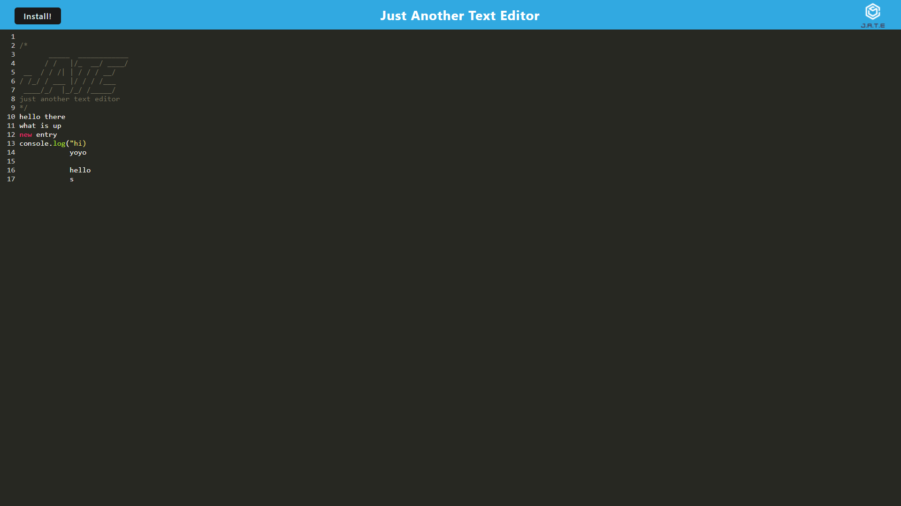

# pwa-text-editor
Progressive Web Application Text Editor

A simple web application that allows the user to edit text. The text is stored locally on the client's machine using indexDB. This application also uses a manifest plugin to allow it to be installable on local machines. This application also uses service workers and caches source files to allow it to be used offline.
Below is a screenshot of the application in use.

